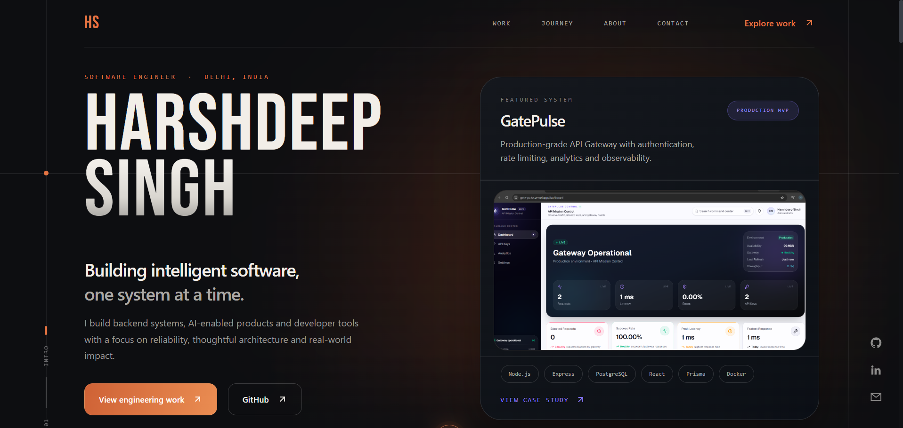
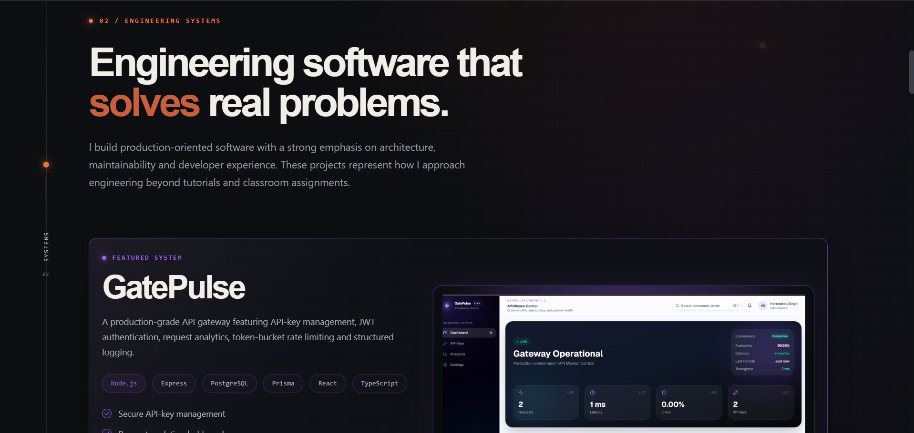
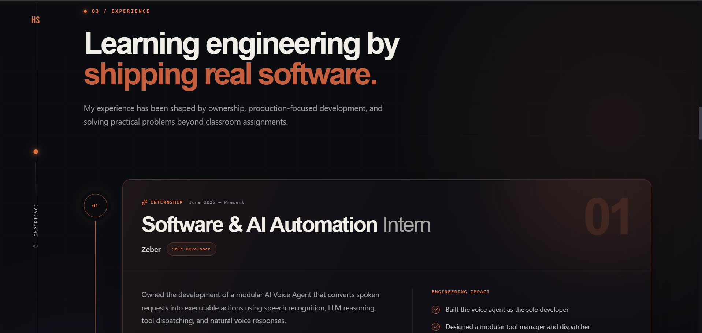
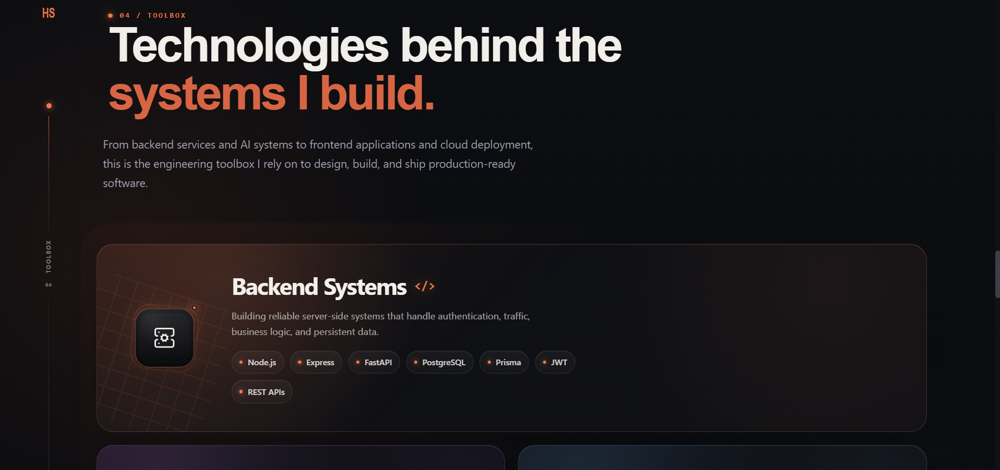
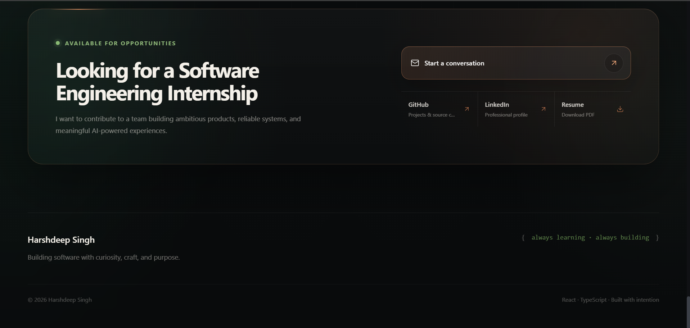

<div align="center">

# Harshdeep Singh

### Building intelligent software, one system at a time.

Production-focused Software Engineering Portfolio showcasing backend systems, AI applications, and developer tools.

<p>
  <a href="https://harshdeep-portfolio-tau.vercel.app/">🌐 Live Portfolio</a> •
  <a href="Harshdeep_Singh_Resume.pdf">📄 Resume</a> •
  <a href="https://www.linkedin.com/in/harshdeep-singh-073b02320/">💼 LinkedIn</a> •
  <a href="https://github.com/harshdeepsingh888-ps">💻 GitHub</a>
</p>

</div>

---

# Portfolio Preview

## Desktop Experience



---

## Engineering Systems



---

## Professional Experience



---

## Technology Toolbox



---

## Contact



---

## Mobile Experience

<p align="center">

</p>

---

# About

This repository contains the source code for my personal engineering portfolio.

Rather than serving as a traditional portfolio website, it is designed as a professional engineering workspace that communicates how I approach software development—from architecting backend systems and AI-powered applications to documenting technical decisions and continuously improving my engineering craft.

The portfolio highlights real projects, practical experience, and the technologies I use to build scalable, maintainable, and production-ready software.

---

# Highlights

- Production-focused engineering portfolio
- Fully responsive desktop and mobile experience
- Modular React architecture
- Professional dark developer-first design
- Engineering timeline and experience showcase
- Technology toolbox with categorized skills
- Project case studies
- Resume download
- Optimized for modern browsers
- Continuous deployment using Vercel

---

# Featured Projects

## GatePulse

A production-grade API Gateway platform built with modern backend engineering practices.

**Highlights**

- API Key Management
- JWT Authentication
- Token Bucket Rate Limiting
- Analytics Dashboard
- Request Logging
- Docker Support
- PostgreSQL + Prisma
- React Dashboard

---

## AI Voice Agent

An AI-powered voice assistant capable of understanding spoken requests and executing real desktop actions.

**Highlights**

- Google Gemini Integration
- Whisper Speech Recognition
- Edge TTS
- Voice Activity Detection
- Modular Tool Dispatcher
- FastAPI Backend
- Natural Voice Conversations

---

# Tech Stack

### Frontend

- React
- TypeScript
- Vite
- CSS
- Lucide Icons

### Backend

- Node.js
- Express.js
- FastAPI
- PostgreSQL
- Prisma

### AI

- Google Gemini
- Whisper
- Edge TTS

### Tools

- Git
- GitHub
- Docker
- Vercel
- VS Code

---

# Features

- Responsive Layout
- Engineering-focused UI
- Modern Typography
- Smooth Section Navigation
- Project Showcase
- Interactive Technology Toolbox
- Professional Experience Timeline
- Resume Download
- Contact Section
- Dark Theme
- Optimized Assets
- Accessibility-conscious Design

---

# Project Structure

```text
.
├── public/
├── README-assets/
├── src/
│   ├── animations/
│   ├── app/
│   ├── components/
│   │   ├── chapters/
│   │   ├── common/
│   │   └── ui/
│   ├── hooks/
│   ├── styles/
│   └── utils/
├── package.json
└── vite.config.ts
```

---

# Getting Started

Clone the repository

```bash
git clone https://github.com/harshdeepsingh888-ps/Harshdeep-Portfolio.git
```

Install dependencies

```bash
npm install
```

Start the development server

```bash
npm run dev
```

Create a production build

```bash
npm run build
```

Preview the production build

```bash
npm run preview
```

---

# Deployment

The portfolio is continuously deployed using **Vercel**.

Every push to the `main` branch automatically generates a new production deployment.

---

# Design Philosophy

This portfolio was designed around a simple principle:

> **Show engineering, not just projects.**

Every section is intentionally structured to communicate software engineering thinking rather than simply displaying completed work.

The visual language emphasizes clarity, structure, and professionalism while maintaining a distinctive developer-focused identity.

---

# Performance Goals

- Fast page load
- Responsive across devices
- Clean component architecture
- Optimized assets
- Accessible navigation
- Maintainable codebase

---

# Roadmap

- [ ] Engineering Case Study pages
- [ ] Interactive project walkthroughs
- [ ] Project search
- [ ] Blog section
- [ ] Motion enhancements
- [ ] Additional accessibility improvements
- [ ] Performance optimization

---

# About Me

I'm a Software Engineering student passionate about backend engineering, AI systems, and developer tooling.

I enjoy building software that solves practical problems while following production-grade engineering practices.

I'm currently seeking Software Engineering Internship opportunities where I can contribute to impactful products and continue growing as an engineer.

---

# Connect With Me

- 🌐 Portfolio: https://harshdeep-portfolio-tau.vercel.app/
- 💼 LinkedIn: https://www.linkedin.com/in/harshdeep-singh-073b02320/
- 💻 GitHub: https://github.com/harshdeepsingh888-ps
- 📧 Email: harshdeepsingh87179@gmail.com

---

# License

This project is licensed under the MIT License.

---

<div align="center">

### Building software with curiosity, craft, and purpose.

Made with ❤️ using React, TypeScript and Vite.

</div>